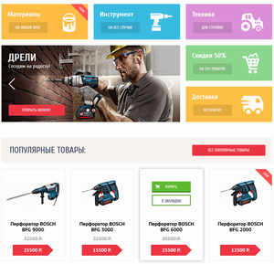

# Личный проект «Техномарт»

* Студент: [Антон Леонидович](https://up.htmlacademy.ru/htmlcss/25/user/948947).
* Наставник: [Антон Шабельников](https://htmlacademy.ru/profile/hulkaton).
---
### Описание
Интернет-магазин инструмента и стройматериалов. Проект интенсива «HTML и CSS. Профессиональная вёрстка сайтов». Представлен двумя страницами - "главная" и "каталог". Демонстрация навыков вёрстки. 
Дизайн и контент собственность HTML-академии.
HTML, CSS и JavaScript полностью мои.
ТРИ СКРИНШОТА СЮДА. И разберись какой правильный синтаксис в файлах этого формата, чтобы красиво было.

![]img/miniature/Техномарт превью 1 кроп ресайз.png "Logo text"

